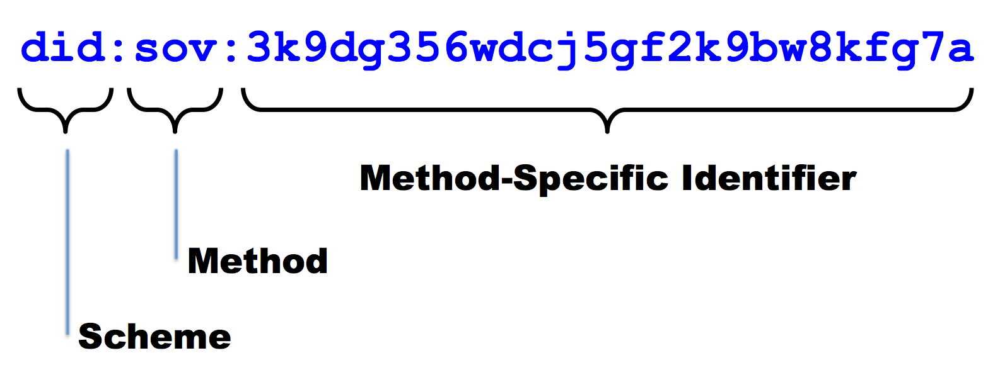

# DID

A decentralized identifier is a new type of globally unique identifier which are fully under the control of the DID subject with  cryptographically verifiable ownership.  DID’s resolve to DID Documents in similar ways as uniform resource names (URNs) except they do not
require a central registration authority, identity provider, or certificate authority.

## DID Format
DIDs follow the same basic pattern as the URN specification. The key difference is that with DIDs the namespace component identifies a DID method, and a DID method specification specifies the format of the method specific identifier:

The Sovrin DID method namestring is sov. The identifier is the base58 encoding of a 128-bit number using the BitCoin/IPFS alphabet. For example, a Sovrin DID can generated by base58-encoding the first half of an Ed25519 verification key.

## DID Document
DID infrastructure can be thought of as a global key-value database in which the database is all DID-compatible blockchains, distributed ledgers, or decentralized networks. In this virtual database, the key is a DID, and the value is a DID document. The purpose of the DID document is to describe the public keys and service endpoints necessary to bootstrap cryptographically-verifiable interactions with the identified entity.  
A DID and DID document are created, resolved, and managed on a system using a specific DID Method. DID methods define how DIDs work within a specific environment. All DID method specs must define the format and generation of the method-specific identifier.

## The Sovrin DID Method Spec
DIDs written to the Sovrin ledger will follow the requirements defined in the [Sovrin DID method spec](https://github.com/sovrin-foundation/sovrin/blob/master/spec/did-method-spec-template.html).

## Public (Global) DIDs on Sovrin 
Public (Global) DIDs are created and updated in Sovrin using a [NYM](https://github.com/hyperledger/indy-node/blob/24a86c5ebf86a2aed26f12c3db0dfc6667137d11/docs/transactions.md#nym) transaction.  
[Code reference](https://github.com/hyperledger/indy-sdk/blob/778a38d92234080bb77c6dd469a8ff298d9b7154/libindy/src/services/ledger/types.rs#L43)  to NYM transaction.
