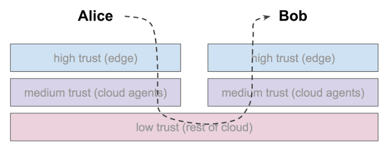

# Janus

Janus is the current codename for a protocol that enables secure
communication between peers. Its name refers to the two-faced figure
from Greek mythology, emphasizing a two-way flow of information.
(This also feels appropriate for the classic crypto communication
stories that feature Alice and Bob.)

Janus is a subset or subprotocol of the overarching protocol for self-sovereign
identity. It assumes the existence of certain ecosystem features such as
agents and keys, and is thus dependent on a larger context.

Janus partially overlaps the mandate of other secure communications
protocols like Signal. The implications of this overlap are discussed
elsewhere.

## Requirements

At the highest level, Janus aims to:

1. Provide highly secure comm channels, with correct basis for trust.
2. Provide strong privacy guarantees as demanded by [Self-Sovereign
   Privacy by Design](
   https://docs.google.com/document/d/1fKAw9p8eJI-7hAZuQ8orMDGYnq7WWpE6QYs1YOTWgjA/edit).
3. Facilitate interoperability (be usable from many programming languages,
   many blockchain technologies, many vendor stacks, many OSes and
   hardware platforms).
4. Be transport-agnostic (work over http, raw tcp, smtp, snail mail,
   carrier pigeon...).
5. Be composable and extensible.

## Agents and Keys

People and institutions can't speak raw bytes on a wire; they use software
that works on their behalf. Each independent, key-weilding piece of software
that represents an identity owner is called an agent.

There are two agent types:

 * Edge. Run on hardware directly controlled by identity owner: mobile
   devices, laptops, on-prem servers (where identity owner = institution).
   High trust. Manage the most privileged keys.
 * Cloud. Run on hardware controlled by someone else: agents as a service.
   Trust is somewhat tempered. Manage delegated, limited-use keys.

Every participant in secure communication has at least one agent.
Each agent needs its own keys. Keys are never copied. (For deep
background on the theory and principles of key management espoused
by Janus, see [this recent research report](https://drive.google.com/open?id=1OEOl5cv69dEidK_Efx8blcYwgyPiaU_c).)

The distinction between identity owners and their keys and agents, and
the trust differences between technologies in the cloud and at the
edge, imply a [model of the ecosystem that is layered and nuanced](message-layers.md).

## Messages

At its heart, Janus thinks about communication as an asynchronous exchange
of messages over any untrusted, unreliable transport. To whatever transport
is used in a given context, Janus adds features such as security, privacy,
reliability, and synchronous patterns like http's familiar request/response.
This allows Janus to provide value in classic RESTful paradigms as well as:

* Broadcasts, pub/sub
* Occasionally connected agents
* Fancy routing (store-and-forward, onion, delivery delay)
* Other protocols (e.g., snail mail)
* Semi-trusted agents (progressive/muted auth, limited proxies)

Janus message exchange can also negotiate an alternate,
non-message-oriented communication mode with trust and security rooted
in Janus's standard guarantees (e.g., video streaming over a channel
built with Janus messages).

## Message Types

The inventory of Janus message types is open; anybody can add their own.
A few message types are well known and trending toward standardization:

* Connection request
* Credential offer, Credential request, Credential issuance
* Proof offer, Proof request, Proof presentation
* Trust ping
* Payment
* Agent interface discovery and back-channel security negotiation
* Arbitrary information (analogous to secure chat or s/mime)
* Noise

## Composability and Transformations

In snail mail, the content of a message and its packaging are orthogonal.
You can send a bill, a photo, or a love letter--or another envelope--in the
same envelope.

Janus messages are similar. Core messages (what you put inside the
envelope) can be packaged and repackaged per circumstance, with
_transformations_:

* Encrypt or sign (possibly more than once)
* Route (possibly in multiple ways)
* Disclose or describe (possibly various things to multiple parties)

## Crypto Transformations

Janus uses elliptic curve cryptography to achieve message availability,
confidentiality, and integrity. It offers three crypto primitives:

```anon_crypt(msg, recipient_verkey)```
<blockquote>Encrypt only for recipient. Sender is anonymous. Parties can be unknown
to each other. The message is tamper evident.</blockquote>

```auth_crypt(msg, recipient_verkey, sender_verkey, sender_sigkey)```
<blockquote>Encrypt only for recipient. Recipient learns sender’s verkey but can’t
prove to anybody else who the sender is (making the message repudiable).
Parties can be unknown to each other. The message is tamper evident.</blockquote>

```sign(msg, sender_sigkey)```
<blockquote>Associate a non-repudiable signature with a message.</blockquote>

## Other Transformations

```Forward(msg)```
<blockquote>Specify where to send something.</blockquote>

```Topicalize(msg)```
<blockquote>Give a message a context/thread and a sequence number within that context.</blockquote>

Bundle -- treat multiple messages as a unit
Type -- describe message type, format, version

## Love Letters

Let us use a familiar circumstance as a case study in secure communication.
Suppose Alice and Bob wish to carry on a private romantic conversation.
We will explore how this interaction unfolds across the edge and cloud
agents owned by Alice and Bob, and how it also involves services in the
low-trust layer of the ecosystem.

The general flow will be as follows:



The state of agents, keys, wallets, and service that provide the backdrop
for this interaction looks like this:

